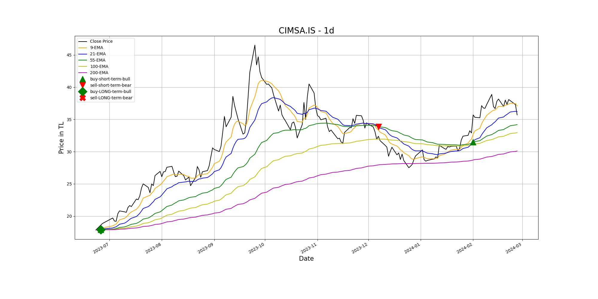

# Stock-EMA-Tracker

**Disclaimer**  The trading strategies and related information in this repo is for the educational purpose only. All investments and trading in the stock market involve risk. Any decisions related to buying/selling of stocks or other financial instruments should only be made after a thorough research and seeking a professional assistance if required. **Disclaimer**

## Overview

The Python script is designed to analyze stock data using Exponential Moving Averages (EMAs) for various ticker symbols and time intervals. It leverages the yfinance library to fetch historical stock data and calculates EMAs to generate buy/sell signals. The script visualizes the stock data along with the EMAs and signal points to aid in technical analysis.

**Key Features:**
- Dynamic Ticker Selection: Users can input different ticker symbols to analyze various stocks.
- Customizable Time Intervals: The script supports different time intervals (e.g., daily, 4-hour) for data analysis.
- EMA Calculation: Calculates EMAs with periods of 9, 21, 55, 100, and 200 to identify trends.
- Signal Generation: Generates buy/sell signals based on EMA crossovers.
Interactive Visualization: Plots the stock data, EMAs, and signal points for visual analysis.

**Functionality:**
- Data Retrieval: Fetches historical stock data using yfinance based on the specified ticker symbol and time interval.
- EMA Calculation: Computes EMAs with varying periods to capture short-term and long-term trends.
- Signal Generation: Determines buy/sell signals by comparing EMA values.
- Plotting: Visualizes the stock data, EMAs, and signal points on a dynamic plot for technical analysis.

**Usage:**
- Specify the ticker symbol and time interval when calling the analyze_stock() function.
- Analyze different stocks by providing unique ticker symbols and selecting appropriate time intervals.
- Interpret the plotted data, EMAs, and signals to make informed trading decisions.

### Why EMA:

 Exponential Moving Average give more weight to the most recent periods. This makes them more reliable than SMAs as they are comparatively better representation of the recent performance of the asset. The EMA is calculated as:


$$
EMA = \frac{(ClosingPrice \times Multiplier) + (PreviousEMA \times (1 - Multiplier))}{Multiplier}
$$

In this formula:

- **Closing Price** refers to the closing price of the current day
- **PreviousEMA** represents the previous EMA value
- **Multiplier** is a constant factor that determines the weight given to recent prices compared to older ones, typically set at 2/3 for EMA calculations

Output of script should look like this



## Environments

```BASH
pyenv local 3.11.3
python -m venv .venv
source .venv/bin/activate
pip install --upgrade pip
pip install -r requirements.txt